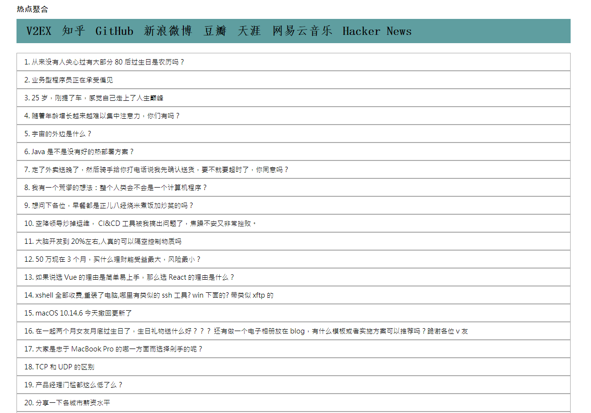

# Hot Crawler


Const520 热点聚合。一站式资讯阅览，轻松掌握热点话题。



### 已展示站点

- V2EX
- 知乎
- GitHub
- 新浪微博
- 豆瓣
- 天涯
- 网易云音乐
- Hacker News

### 待处理站点 TODO

- Twitter

### 使用技术
后端

- Spring Boot
- Spring Boot Web
- Spring Boot Redis
- Spring Boot Devtools
- Spring Scheduling Tasks
- Restful API
- Swagger UI/SpringFox
- Lombok

页面爬取解析
- Jsoup
- Jsonpath

前端

- Thymeleaf
- jQuery

缓存
- Redis

测试
- JUnit4

部署

- Nginx 代理
- Spring Boot embedded server - Jetty

### 如何运行
运行前必需保证已安装 Git, JDK, Maven, Redis 等软件。

```shell
$ git clone https://github.com/tagnja/hot-crawler.git
$ cd hot-crawler
$ mvn package spring-boot:repackage
$ java -jar target/hotcrawler-1.0-SNAPSHOT.jar
```

### 如何贡献

可对本项目做以下贡献

1. 添加有价值的网站到“待处理站点” 的 todo list 中。
2. 实现带实现站点爬虫。
3. 修复 issues。

### 其它

- [更新日志](update_log.md) 
