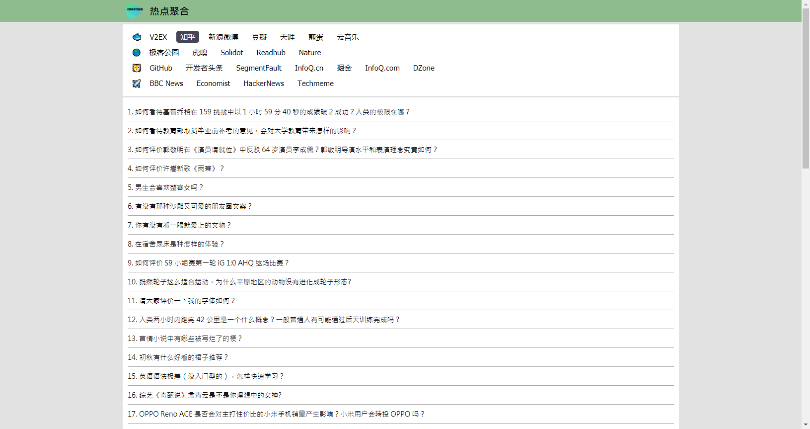

# hot-crawler

[](https://github.com/tagnja/hot-crawler/issues)
[](https://github.com/tagnja/hot-crawler/stargazers)
[](https://github.com/tagnja/hot-crawler/network)
[](https://www.codacy.com/manual/tagnja/hot-crawler?utm_source=github.com&amp;utm_medium=referral&amp;utm_content=tagnja/hot-crawler&amp;utm_campaign=Badge_Grade)
[](https://codecov.io/gh/tagnja/hot-crawler)
[](https://travis-ci.com/tagnja/hot-crawler)

Languages: [English](README.md) | [中文简体](README_zh_CN.md)

## What's hot-crawler

**hot-crawler** is a web crawler about hot information on excellent websites. It can help you quickly access valuable information on many websites. It is compatible with multiple terminal devices, such as personal computers, mobile phones, and tablets. These websites are mainly composed of two languages, Chinese and English. As shown in the figure below.



## How to develop

### Before starting

To develop Hot-Crawler, you need to install the following softwares:

- Git
- JDK
- Maven
- Redis

We strongly suggest using [IntelliJ IDEA](https://www.jetbrains.com/idea/?fromMenu) to develop this project.

## How to run

### How to run with Maven command line

1. Startup your Redis Server firstly.

2. Running the project with Spring Boot maven plugin.

    ```
    cd hot-crawler
    mvn spring-boot:run
    ```

3. Visting the website by http://localhost:8080

## Document

For example of crawler development to view [crawler development tutorial](documents/crawler-development-tutorial_en.md).

For using techniques of the project to view [use techniques list](documents/techniques-list_en.md).

For the complete crawled websites to view [websites crawler list](documents/websites-list_en.md).

For more info about update log to view [update log](documents/update_log.md).

## Contributing

Contributing is welcome! Please check out the [Contributing to hot-crawler guide](CONTRIBUTING.md).

## License

hot-crawler is released under the [MIT License](https://opensource.org/licenses/MIT).

