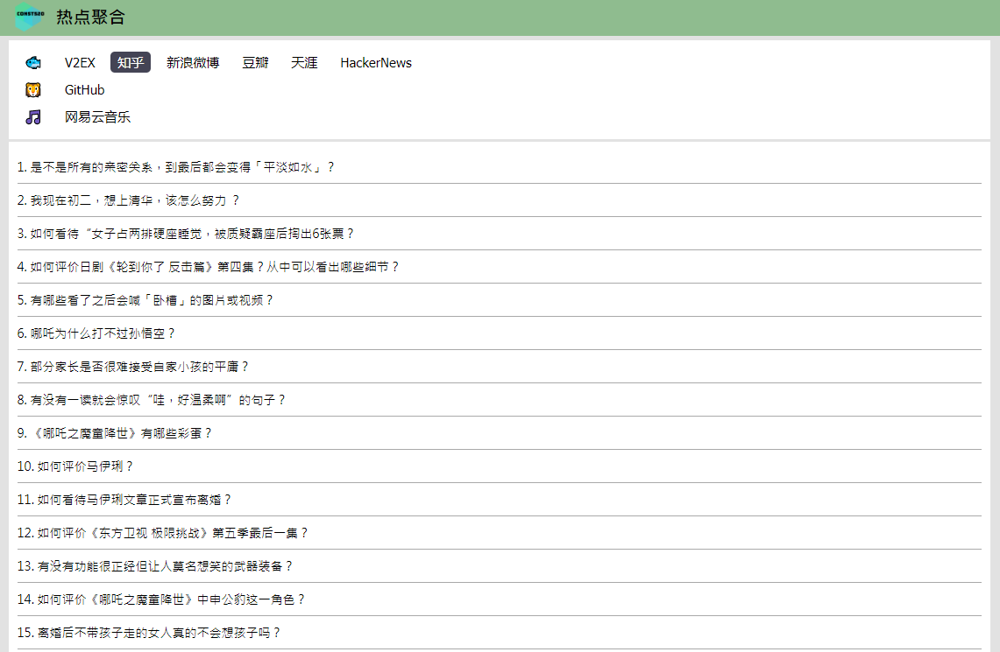

# Hot Crawler

**const520 热点聚合**

汇集热点内容，一站式阅读体验。



### 展示站点

- 社交媒体 🐟
  - [x] V2EX
  - [x] 知乎
  - [x] 新浪微博
  - [x] 豆瓣
  - [x] 天涯
  - [x] 煎蛋
  - [x] 网易云音乐
  - [ ] ..果壳网. `https://www.guokr.com/science/category/all`
- 科技新闻 🌎
  - [x] 极客公园
  - [x] 虎嗅
  - [x] Techmeme
  - [x] Nature
  - [ ] Science. `https://www.sciencemag.org/news/latest-news`
- 开发者 🦁
  - [x] GitHub
  - [x] 开发者头条
  - [x] SegmentFault
  - [x] InfoQ.cn 
  - [ ] ..掘金. `https://juejin.im/`
  - [ ] InfoQ.com. `https://www.infoq.com/news/`
  - [ ] DZone. `https://dzone.com/list`
- 科学上网 ✈️
  - [x] BBC News
  - [x] The Economist
  - [x] Hacker News
  - [ ] Medium

### 使用技术
后端

- Spring Boot
- Spring Boot Web
- Spring Boot Redis
- Spring Boot Devtools
- Spring Scheduling Tasks
- SLF4j
- RESTful API
- Swagger UI/SpringFox
- Lombok

页面爬取解析
- Jsoup
- Jsonpath

前端

- Thymeleaf
- jQuery

缓存
- Redis

测试
- JUnit4

部署

- Nginx proxy
- Spring Boot embedded server - Jetty

### 如何运行
运行前必须保证已安装 Git, JDK, Maven, Redis 等软件。

```shell
# Download
$ git clone https://github.com/tagnja/hot-crawler.git
# Running redis in your computer
$ ./redis-server
# Running project
$ cd hot-crawler
$ mvn spring-boot:run
```

### 添加一个页面爬虫快速指南

1. 添加站点信息在 hot-crawler/src/main/resources/sites.properties。注意，序号 sites[0] 不能和已存在的重复。

   ```
   #example
   cates[0].sites[0].id = 1
   cates[0].sites[0].name = example
   cates[0].sites[0].processorName: ExampleHotProcessor
   ```
   
2. 添加热点爬取处理器，如 hot-crawler/src/main/java/com/taogen/hotcrawler/commons/crawler/impl/ExampleHotProcessor.java

   ```java
   @Component("ExampleHotProcessor")
   public class ExampleHotProcessor implements HotProcessor
   {
       @Override
       public List<Info> crawlHotList() 
       {
       	...
       }
   }
   ```

3. 本地测试和运行

   - 运行 Redis 缓存。

   - 进入项目根目录，执行单元测试

     ```
     $ mvn test
     ```

   - 进入项目根目录，使用 maven 插件运行项目

     ```
     $ mvn spring-boot:run
     ```

   - 访问 http://localhost:8080 ，即可看到你添加的爬虫 example 的页面。

### 如何贡献

可对本项目做以下贡献

1. 添加有价值的网站到“待处理站点” 的 todo list 中。
2. 实现“待处理站点”爬虫。
3. 修复 issues。

### 其它

- [更新日志](update_log.md) 
